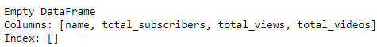

# Data Portfolio: Top 10 UK Youtubers 2024

# Table of Contents
-	[Objective](#objective)
-	[Data Source](#data-source)
-	[Stages](#stages)
-	[Design](#design)
   -	[Mockup](#mockup)
   -	[Tools](#tools)
-	[Development](#development)
   - [Pseudocode](#pseudocode)
   - [Data Exploration](#data-exploration)
   - [Data Cleaning](#data-cleaning)
   - [Transform the Data](#transform-data)
   - [Create the final Python Dataframe](#python-dataframe)
- [Testing](#testing)
  - [Data Quality Tests](#data-quality-tests)
- [Visualization](#visualization)
  - [Results](#results)
  - [DAX Measures](#dax-measures)
- [Analysis](#analysis)
  - [Findings](#findings)
  - [Validation](#validation)
  - [Discovery](#discovery)
- [Recommendations](#recommendations)
  - [Potential ROI](#potential-roi)
  - [Potential Coursers of Action](#potential-action)
- [Conclusion](#conclusion)

# Objective
   - Whats the Key Point?

Head of Marketing wants to find out who the top Youtubers are in 2024 and determine which one would be the best to run a amrketing campaign throughtout the rest of the year

   - What is the ideal solution?

To create a dashboard that provides insights into the top UK Youtubers that include their:
- subscriber count
- total views
- total videos created
- engagement metrics

This will inform the marketing team make the best pick of which youtubers to offer a amrkettin campaign to.

## User Story
  As the Head of Marketing, I want to identify the to youtubers in the UK based on their subscription numbers, uploaded videos and views accumulated, so that I can decided which channels would be best to run a marketing campaign with to generate good ROI

# Data Source
- What data is needed to achive our goal?

We need data on the top UK Youtubers in 2024 that include
- Channel names
- total View Count
- total subscribers
- total videos uploaded

The source of the data was from Kaggle that provided an excel table with the information. An Youtube APi was also required to obtain some extra information

# Stages
- Design
- Development
- Testing
- Analysis


# Design

## Dashboard components required
- What should the dashboard contain based on the requirements provided?

To understand what it should contain, we need to figure out what questions we want the dashboard to awnser:
1. Who are the top 10 Youtubers with most subscribers?
2. Which 3 channels uploaded the most videos?
3. Which 3 channels had the msot views in total?
4. Which 3 channels have the highest average of viewws per video?
5. Which 3 channels has the highest views per subscriber ratio?
6. Which 3 channels have the highest subscriber engagement rate per video uploaded?

For now these are the questions we want awnsered, subject to change later.

## Dashboard mockup

Some of the data visuals that may be appropriated in answering our questions include:
1. Table
2. Treemap
3. Scorecards
4. Horizontal Bar chart


## Tools

| Tool | Purpose |
| --- | --- |
| Excel | Exploring the Data |
| Jupyter Python | Cleaning, testing and analysing the data |
| Power BI | Visualizing the data via interactive dashboard |
| Github | Hosting the project documentation and version control |
| Inkscape | Designing the mockup of the dashboard |

# Development

## Pseudocode

- Whats the general approach in creating this solution from start to finish?

1. Get the data
2. Explore the data in Excel
3. Import the data to the Jupyter Notebook
4. Turn the table into a dataframe
5. Clean the data with Python
6. Test the data with Python
7. Visualize the data in Power BI
8. Generate the findings based on the insights
9. Write the documentation+commentary
10. Publish the data on Github Pages

## Data Exploration Notes
This is the stage where you have a scan of whats in the data, errors, inconsistencies, bugs, strange and corrupted characters, etc.
- What are your initial observations with this data? What's caught your attention so far?

1. There are at least 4 columns that constains the data that we need for this analysis, which signals we have everything we need without contacting the client for any more data
2. The first column contains the channel ID snapped to the channel name. We will need to extract the channel name from this into its own collumn
3. Some of these cells and headers are in a different language, so we need to confirm if these columns we require, if so, we will need to adress them
4. We have more than enough data, so we will need to delete columns that aren't relevant for us

## Data Cleaning

- What do we expect the clean data to look like? What should it contain? What constraints we should apply to it?

The aim is to refine the database to ensure it is structured and sued for analysis

The cleaned data should meet the following criteria and constraints:
- Only relevant columns should be retained
- All data types should be apropriate for the contents of each column
- No columns should contain null values, indicating complete data for all records

Bellow is a table containning the constraints on our cleaned data

| Property | Description |
| --- | --- |
| Number of Rows | 100 |
Number of Columns | 4 |

And here is a tabular representing the expected schema of our cleaned data

| Column Name | Data Type | Nullable |
| --- | --- | --- |
| channel_name | VARCHAR | NO|
| total_subscribers | INTEGER | NO |
| total_views | INTEGER | NO |
| total_videos | INTEGER | NO |

- What steps are needed to clean and shape the data into the desired format?

1. Remove unecessary coumns
2. Extract youtube channel from the first column
3. Rename column ehaders using aliases

## Transform the Data

```python
# Importing the table into python
import pandas as pd
df = pd.read_csv(r'C:\Users\User\Documents\Data Analyst Bootcamp\Projects\Top 100 Social Media Influencers\youtube_data_from_python.csv')

# Function to determine the size of the stack
def createStack():
    stack = []
    return stack
 
# Stack is empty if the size is 0
def size(stack):
    return len(stack)
 
    
# Function to add an item to stack .
# It increases size by 1 
def isEmpty(stack):
    if size(stack) == 0:
        return True
 
 
# Function to remove an item from stack.
# It decreases size by 1
def push(stack, item):
    stack.append(item)
 

def pop(stack):
    if isEmpty(stack):
        return
    return stack.pop()

# Function to extract the name portion
def extractName(string):
    n = len(string)
 
    # Create a empty stack
    stack = createStack()
 
    # Push all characters of string to stack
    for i in range(0, n, 1):
        push(stack, string[i])
 
    # Making the string empty since all characters are saved in stack
    string = ""
 
    # Pop all characters of string and put them back to string
    for i in range(0, 26, 1):
        string += pop(stack)
        if string[i] == '@':
            break
        
    name = ''.join(map(str, stack))
 
    return name

# Calling the function and inaerting the result as a new column
nameArray = []

for i in df['NOMBRE']:
    nameArray.append(extractName(i))

df.insert(2, "name", nameArray, True)
```

## Creating the final dataframe in Python

```python
# Filtering so we only have the desired columns
df2 = df.filter(items = ['name', 'total_subscribers', 'total_views', 'total_videos'])

# Exporting the dataframe as an excel table
# determining the name of the file
file_name = 'view_uk_youtubers_2024.xlsx'
 
# saving the excel
df2.to_excel(file_name)
print('DataFrame is written to Excel File successfully.')

```

# Testing

- What data qualtiy and validation checks are you going to create?

Here are the data quality checks

## Row and Column Count Check

```python
import pandas as pd
df = pd.read_excel(r'C:\Users\User\Documents\Data Analyst Bootcamp\Projects\Top 100 Social Media Influencers\view_uk_youtubers_2024.xlsx')
df
```


## Data Type Check
```python
df.info()
```


## Duplicate Records Check

```python
#identify duplicate rows
duplicateRows = df[df.duplicated(keep='last')]
print(duplicateRows)
```


# Visualization
